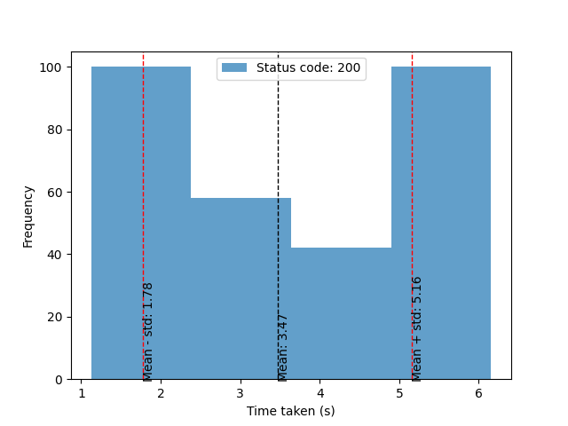
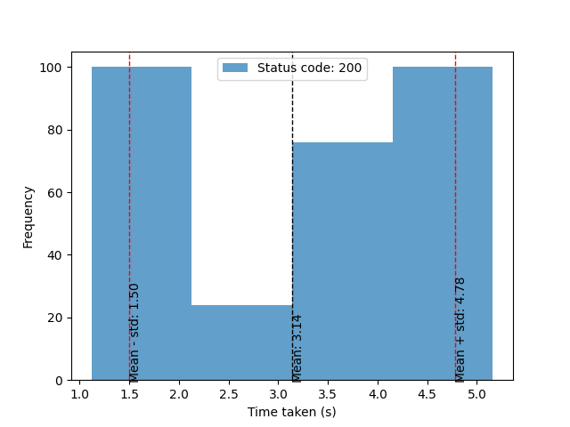

# Setup for miner

Make sure that you have a registered hotkey to Subnet 23. If you haven't done so, please refer to https://docs.bittensor.com/subnets/register-validate-mine


### Incentive Distribution

| Category        | Incentive Distribution | Timeout (s)                                                                                                        |
|-----------------|------------------------|--------------------------------------------------------------------------------------------------------------------|
| RealitiesEdgeXL | 29%                    | 12 |
| AnimeV3         | 27%                    | 12 |
| JuggernautXL | 17%                    | 12 |
| DreamShaperXL     | 6%                     | 16 |
| GoJourney       | 4%                     | 12 |
| Llama3_70b         | 4%                     | 128 |
| DallE    | 4%                     | 32 |
| Gemma7b         | 3%                     | 64 |
| StickerMaker    | 3%                     | 64 |
| FaceToMany      | 3%                     | 64 |


## Step by Step Guide
1. Git clone and install requirements
```bash
git clone https://github.com/NicheTensor/NicheImage
cd NicheImage
python -m venv main_env
source main_env/bin/activate
pip install -e .
pip uninstall uvloop -y
git submodule update --init --recursive
. generation_models/custom_pipelines/scripts/download_antelopev2.sh
```
2. Select miner based on incentive distribution and subnet state at https://nicheimage.streamlit.app/
3. Setup prequisites if needed
- For StickerMaker & FaceToMany, find the guide [here](comfyui_category.md)
- For Gemma7b, find the guide [here](vllm_category.md)
- For GoJourney, register [here](https://www.goapi.ai/midjourney-api) and get the `GOJOURNEY_API_KEY`

4. Start the endpoint

**For Image Generation Category**
- Important notes
    - For the DallE model, you need to set `--num_gpus 0` and `--num_replicas` equal to your `max_concurrent_requests` to allow the miner to handle multiple requests concurrently.
```bash
source main_env/bin/activate
GOJOURNEY_API_KEY=<your-gojourney-api-key> \ # set if you use GoJourney model
OPENAI_API_KEY=<your-openai-api-key> \ # set if you use DallE model
RAY_SERVE_QUEUE_LENGTH_RESPONSE_DEADLINE_S=1.0 \
PROCESS_MODE=<your-task-type> \ # set if you use GoJourney model
pm2 start python --name "miner_endpoint" -- -m services.miner_endpoint.app \
--model_name <selected-model-name> \
--num_replicas X --num_gpus Y \ # num_gpus * num_replicas = your_total_gpus_count
--port 10006 # default port
```

**For Text Generation Category**
```bash
source main_env/bin/activate
HF_TOKEN=<your-huggingface-token> \
pm2 start python --name "miner_endpoint" -- -m services.miner_endpoint.text_app --model_name <selected-model-name> --num_replicas X --num_gpus Y \
--port 10006 # default port
```

5. Start miner
```bash
pm2 start python --name "miner" \
-- \
-m neurons.miner.miner \
--netuid 23 \
--wallet.name <wallet_name> --wallet.hotkey <wallet_hotkey> \
--subtensor.network <network> \ # default is finney
--axon.port <your_public_port> \
--generate_endpoint http://127.0.0.1:10006/generate \ # change if you use different port or host
--info_endpoint http://127.0.0.1:10006/info \ # change if you use different port or host
--miner.total_volume <your-generation-volume> # default is 40. Change based on your model timeout value and GPU capacity
--miner.max_concurrent_requests <your-max-concurrent-requests> # default is 4. Change based on your model timeout value and GPU capacity
```


## Benchmark Your Setup

You can benchmark your setup by running the following command:
```bash
python tests/benchmark_sdxl.py \
--max_concurrent_requests <your-max-concurrent-requests> \ # should equal to your miner.max_concurrent_requests
--n_times <number-of-iterations> \ # n_times * max_concurrent_requests should be less than or equal to your miner.total_volume
--model_name <selected-model-name>
```
This script will run the miner with the specified number of concurrent requests and measure the average latency and throughput.

**Output**
- Console Print:
    - report (dict): A dictionary with keys are status_code. Values are list of latencies for each request. Example: `{200: [0.1, 0.2, 0.3], 408: [12, 12, 12]}`
- Plot latency histogram:
    - x-axis: latency in seconds
    - y-axis: number of requests

Example Plot
- [with ControlNet] RealitiesEdgeXL model with 3 concurrent requests and 100 iterations

- [without ControlNet] RealitiesEdgeXL model with 3 concurrent requests and 100 iterations

